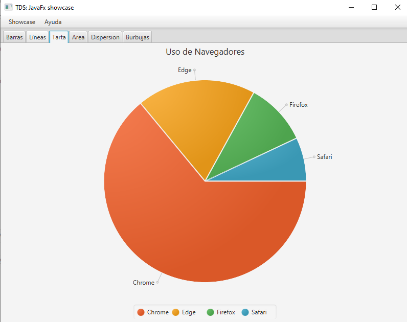

### Showcase de JavaFx para asignatura TDS

Esta implementación del showcase sólo utiliza código Java. No se usan plantillas FXML. Contiene comentarios explicativos y ejemplos de uso de diferentes controles JavaFX.

Usa el menú superior para acceder a los diferentes componentes del showcase.

## Paneles

Este Showcase muestra gran parte de los paneles que ofrece JavaFX para que veamos su posibilidades y variaciones

## Gráficas

Este Showcase muestra gran parte de las gráficas que ofrece JavaFx para que aprendamos a manejarlas

