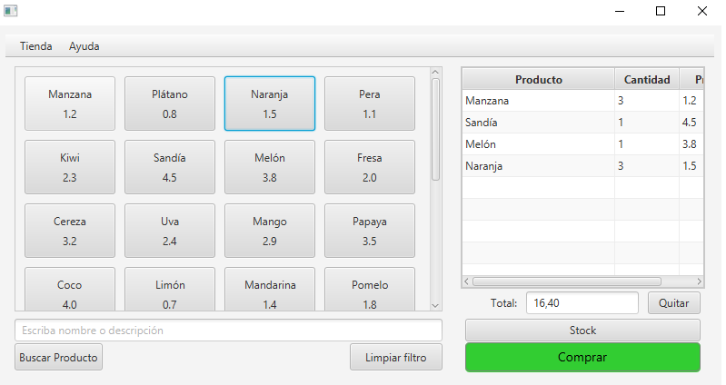
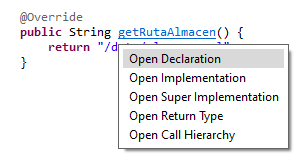
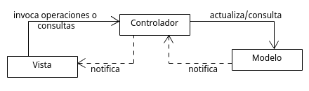
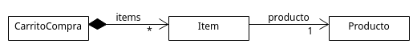

# Arquitectura de una aplicación JavaFX con MVC

En esta práctica se pretende estudiar cómo aplicar el patrón MVC a una 
aplicación JavaFX y cómo conseguir que la aplicación se modular y robusta.
Para ello se utilizará como ejemplo una aplicación JavaFX simple
ya construida que permitirá ilustrar los conceptos principales.
Sobre esta aplicación se propondrán dos mejoras en forma de ejercicio y se realizarán algunas cuestiones.

## La aplicación TPV

La aplicación de ejemplo implementa un Terminal Punto de Venta (TPV) como los que se usan en los cajeros de los supermercados. El sistema maneja un catálogo de productos y permite al cajero marcar los productos de la compra.


 
### Guía de navegación

Para poder explorar la implementación de manera cómoda es buena idea usar los atajos y funcionalidades de Eclipse.

* Si pulsas CTRL y pones el ratón encima de un método aparece un diálogo que permite navegar hacia:
  - Los subtipos que sobreescriben el método (Open implementation)
  - Los supertipos que declaran o implementan el método (Open Super Implementation)
  - Los lugares del código donde se invoca el método (Open Call Hierarchy)
    


  Nota: El uso de estas tres herramientas es **fundamental** para poder explorar el código de un proyecto.

* Si el cursor está sobre el nombre de un clase, pulsar CTRL+T muestra *Quick type hierarchy* que es un diálogo con la jerarquía de tipos.

* Para buscar una clase, pulsar CTRL+SHIFT+T y escribir el nombre de la clase.

### Ejercicio 1 

- Clona el repositorio donde está la aplicación. 
- Importa el proyecto en Ecipse.
- Ejecuta la clase `tds.tpv.App` y comprueba que la aplicación funciona.


## Conceptos básicos

El patrón MVC tiene tres componentes básicos:

- **Modelo**: Se refiere a las clases y las relaciones que representan los conceptos del dominio. Cuando hablamos del dominio de aplicación nos referimos al problema, área de interés o "negocio" que nuestra aplicación aborda.
Por tanto, el modelo representa los datos, la lógica de negocio y las reglas de la aplicación.

- **Vista**. Se refiere a la interfaz de usuario (UI) y clases Java que le dan soporte. Se encarga de presentar los datos de interés, que estarán representados en el modelo. También gestiona la interacción con el usuario respondiendo a los eventos sobre los controles de la interfaz. En el caso de JavaFX, la vista se compone de: o bien (1) las clases que implementan la vista y sus manejadores de eventos, o bien, (2) los ficheros FXML que definen el diseño y estructura de la interfaz junto a los controladores de la vista (`ViewController`) que implementan los manejadores de los eventos resultantes de las interacciones del usario con la interfaz.

- **Controlador**. Actúa como intermediario entre la vista y el modelo. Incluye métodos que reflejan las "operaciones de negocio" que un usuario querría hacer sobre la aplicación (es decir, las historias de usuario elicitadas). Por ejemplo, en el TPV se espera que el controlador implemente operaciones como "iniciar una nueva compra", "añadir un elemento a la compra o carrito", "listar los productos disponibles", etc. La interfaz de usuario invoca a esas operaciones y obtiene una respuesta que es la que presenta al usuario. Las operaciones del controlador se encargan de recuperar o almacenar los datos de la base de datos (ej., de un Repositorio).

Los componentes del modelo MVC se comunican como muestra la siguiente imagen:



Las notificaciones de cambios entre el modelo y el controlador, y entre el controlador y la vista se implementa habitualmente utilizando el patrón Observer.
Estas notificaciones son necesarias cuando se quiere reaccionar a cambios "externos", es decir, que no vienen provocados por acciones directas del usuario. En este ejemplo simple no las pondremos en práctica.

**Nota**: Hay muchas variantes del patrón MVC. En este caso al ser una aplicación de escritorio donde todos los objetos están en memoria es sencillo y conveniente que los objetos del modelo puedan "viajar" del controlador a la vista. En un ambiente distribuido se suelen utilizar DTOs (Data Transfer Object) para comunicar la vista y el controlador.

Las restricciones son las siguientes:
- La vista **nunca escribe en el modelo**.
- Debería ser posible reutilizar el mismo controlador para una vista diferente. Una forma sencilla de pensarlo es preguntarse lo siguiente: "Si implemento una interfaz de línea de comandos (CLI), ¿podría reutilizar el mismo controlador para obtener la misma funcionalidad?". Si la respuesta es que no, es posible que haya lógica de negocio que se haya implementado en la vista y deba estar en el controlador.

## Aplicación de MVC al ejemplo

A continuación se discute la arquitectura de la aplicación TPV.

### Modelo

El modelo se encuentra en el paquete `tds.tpv.negocio.modelo`. 



#### Ejercicio 2.
Inspecciona las clases del modelo.

- ¿Qué lógica de negocio implementa el modelo?

### Controlador

El controlador está en el paquete `tds.tpv.negocio.controladores`. Se encarga de gestionar una sesión de compra (ver campo `carrito`). 

El controlador también comprueba precondiciones, como por ejemplo  que el stock nunca sea negativo. Para ello hace uso de la librería [Guava](https://github.com/google/guava) que ofrece la clase `Preconditions` para facilitar esta tarea.

El controlador además necesita acceder a la persistencia.
Para ello usa el concepto de *Repositorio*. En este caso, el repositorio contendrá la lista de productos existentes en la aplicación, junto con la cantidad de existencias de cada producto. El repositorio no solo colecta los productos, además ofrece métodos para retornar todos los productos o buscar productos por filtros (como por ejemplo, por código). También incorpora los métodos encargados de mantener actualizada la colección de productos que gestiona el repositorio (añadir, borrar o actualizar productos). Esta responsabilidad se extiende a la implementación de las operaciones de persistencia de los productos sobre un origen de datos (en nuestro caso, sobre ficheros JSON).

#### Ejercicio 3.

* ¿Por qué `ProductoRepository` es una interfaz?
* ¿Por qué se pasa como parámetro en lugar de hacer en el constructor: `this.repositorioProductos = new ProductoRepositoryImpl()`?

### Vista

Las vistas se cargan a partir de los ficheros FXML que están en la carpeta `src/main/resources`.

La vista invoca al controlador. Para ello necesita obtener una instancia del mismo haciendo uso de la llamada:

```java
controlador = Configuracion.getInstancia().getControladorTPV();
```

La interfaz de usuario de la aplicación necesitará cambiar para mostrar las diferentes visualizaciones (pantallas) que contiene, respondiendo a las acciones del usuario. Esto es lo que conmunmente se conoce como navegación. Es decir, mostrar una ventana a partir de las interacciones del usuario con otra ventana. Para encapsular este comportamiento se implementa la clase `SceneManager` en el paquete 'tds.tpv.vista', la cual se encarga de centralizar la carga de los ficheros FXML y el cómo hacerlos visibles ofreciendo métodos de navegación (por ejemplo, 'showVentanaPrincipal' o 'showTiendaStock', entre otros). De esta manera se independiza la navegación entre las diferentes visualizaciones de los controladores de vista concretos de cada pantalla.

#### Ejercicio 4.

En la vista hay un trozo código que modifica directamente el modelo.

* Descubre dónde está. Pista: usa "Open Call Hierarchy" desde los métodos que modifican el modelo (ej., addItem, incrementarCantidad, etc.) y comprueba desde dónde se están invocando.
* ¿Cómo podrías evitarlo?

### Configuración

Normalmente una aplicación tiene dependencias con diferentes servicios externos, como bases de datos, APIs, etc. Es buena idea que estos servicios estén parametrizados de manera que puedan cambiarse sin modificar la aplicación.

También, en este caso, deseamos que el controlador no esté fuertemente ligado a la aplicación.

Para abordar esto se utiliza la clase `Configuracion` como un contenedor de dependencias.

#### Ejercicio 5.

* Piensa en ejemplos donde esta aproximación puede ser beneficiosa.

#### Ejercicio 6.

Los patrones GRASP (experto, creador y controlador) son muy útiles a la hora de distribuir la implementación de las responsabilidades entre las clases del negocio de las aplicaciones (controladores de aplicación y clases del modelo). Están pensados para que la implementación de dichas responsabilidades (mediante métodos) quede distribuida de forma homogénea atendiendo a la información que gestiona cada clase. De esta manera, la calidad de nuestro código se verá muy beneficiada con su uso. 

* Detecta la violación de patrones GRASP en esta aplicación: encuentra dónde se violan y propón una solución correcta que no los viole.

