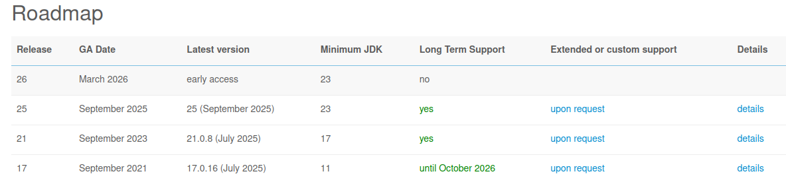
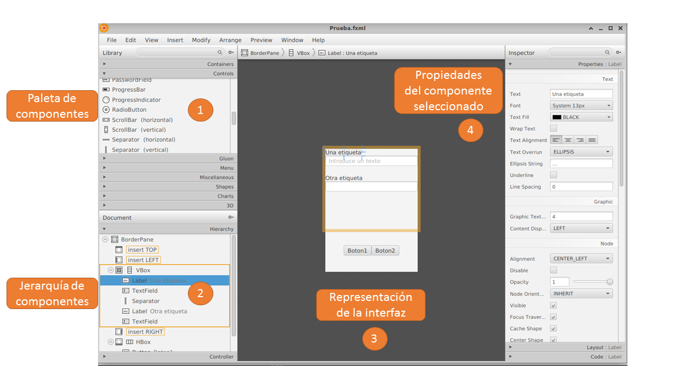

# Prácticas de JavaFX - Sesión 1

En estas prácticas se cubrirán los contenidos necesarios para desarrollar interfaces gráficas en **JavaFX**. El objetivo es aprender los elementos fundamentales de JavaFX para construir desde interfaces muy simples hasta interfaces más avanzadas, y tener la base suficiente para seguir explorando la librería por cuenta propia.

El tutorial incluye ejemplos y ejercicios prácticos. Se recomienda que los copies en tu entorno de programación (por ejemplo, Eclipse), los ejecutes y los modifiques para experimentar con ellos.

## Recursos

- Tutorial: https://jenkov.com/tutorials/javafx/index.html
- Tutorial (en inglés y español): https://code.makery.ch/library/javafx-tutorial/part1/


## 0. Configuración de JavaFx

JavaFX se puede configurar de diversas maneras. Para simplificar, nosotros usaremos Maven para indicar la dependencia
de nuestro proyecto con JavaFX (ver https://openjfx.io/openjfx-docs/#maven).

Utilizaremos un plug-in de Maven que se encarga de realizar toda la configuración y permite lanzar la aplicación. 
Para ello hay que añadirlo al `poml.xml` de nuestro proyecto. Como se observa, en este caso la configuración consiste
en especificar la clase que va a lanzar la aplicación.

```xml
<build>
    <plugins>
        <plugin>
            <groupId>org.openjfx</groupId>
            <artifactId>javafx-maven-plugin</artifactId>
            <version>0.0.8</version>
            <configuration>
                <mainClass>mi.proyecto.HelloFX</mainClass>
            </configuration>
        </plugin>
    </plugins>
</build>
```

En https://github.com/openjfx/javafx-maven-plugin se describen más opciones.

Por otra parte, también hay que añadir las dependencias.

```xml
<dependencies>
  <dependency>
    <groupId>org.openjfx</groupId>
    <artifactId>javafx-controls</artifactId>
    <version>25</version>
  </dependency>
    <dependency>
    <groupId>org.openjfx</groupId>
    <artifactId>javafx-fxml</artifactId>
    <version>25</version>
  </dependency>
</dependencies>
```

La siguiente imagen muestra la compatibilidad de las diferentes versiones de JavaFX y JDK
(obtenida de https://gluonhq.com/products/javafx/)



Hay dos formas en que podemos ejecutar JavaFX. 

### Lanzar aplicación con Maven
La primera es utilizando Maven para que el plugin de JavaFX
se encargue de configurar los módulos de JavaFX al lanzar la aplicación, para ello:

```
mvn javafx:run
```

o desde Eclipse:

```
Run As -> Maven build... -> Goal: javafx:run
```

Es importante que `<mainClass>mi.proyecto.HelloFX</mainClass>` referencie a la clase "main" correcta.

### Lanzar aplicación desde Eclipse

La segunda opción es indicar en la configuración estándar de Eclipse (Runtime configuration) los módulos
de JavaFx que deben activarse. Para ello hay que realizar dos pasos:

1. Descargar la distribución correcta de JavaFX (según lo configurado en Maven) de aquí: https://gluonhq.com/products/javafx/

2. En la sección `VM arguments` de la "Run configuración" se debe indicar lo siguiente:

```
--module-path <ruta-a-javafx>/lib --add-modules javafx.controls,javafx.fxml
```

### Configuración de Eclipse

Hay un un plugin para Eclipse que permite crear ficheros FXML y abrir Scene Builder desde Eclipse.

Instalar el pulgin de JavaFX para Eclipse en su **versión 3.11** (solo disponible como update-site, no en el marketplace)
[e(fx)clipse 3.11 Plugin - update site](https://download.eclipse.org/efxclipse/updates-nightly/repository/) 

NOTA: **No** usar **Eclipse MarketPlace** para la instalación del plugin.

## 1. Primera ventana en JavaFX

En una aplicación JavaFX la clase principal debe extender de `Application` y sobreescribir el método `start(Stage primaryStage)`.
El objeto `Stage` representa la ventana principal, y dentro de él se incluye una escena (`Scene`) que contiene los elementos gráficos (nodos).

### Ejemplo básico

```java
import javafx.application.Application;
import javafx.scene.Scene;
import javafx.scene.control.Label;
import javafx.scene.layout.FlowPane;
import javafx.stage.Stage;

public class HolaMundoJavaFX extends Application {

    @Override
    public void start(Stage primaryStage) {
        // Crear un nodo (en este caso, una etiqueta)
        Label etiqueta = new Label("Hola Mundo con JavaFX");

        // Crear un contenedor y añadir la etiqueta
        FlowPane root = new FlowPane();
        root.getChildren().add(etiqueta);

        // Crear la escena con el contenedor
        Scene scene = new Scene(root, 300, 200);

        // Configurar la ventana principal (Stage)
        primaryStage.setTitle("Mi primera ventana en JavaFX");
        primaryStage.setScene(scene);
        primaryStage.show();
    }

    public static void main(String[] args) {
        launch(args);
    }
}
```

### Ejercicio

1. Cambia el tamaño inicial de la ventana.
2. Modifica el título de la ventana.
3. Añade más componentes al `FlowPane` y observa cómo se colocan. Por ejemplo, más etiquetas.
¿Qué tipo de layout es un `FlowPane`?

---

## 2. Estructura de una interfaz en JavaFX

### Conceptos básicos

A continuación se describen algunos de los conceptos básicos de JavaFX.

* **Stage**. En JavaFX un _Stage_ representa una ventana de la aplicación. Dentro de un Stage se puede insertar una Scene que representa el contenido mostrado dentro de la ventana.

Cuando una aplicación JavaFX se inicia, se crea un objeto Stage raíz, que se pasa al método `start(Stage primaryStage)` de la clase principal de la aplicación JavaFX (que hereda de la clase `Application`). Si se quieren abrir ventanas adicionales, se pueden crear nuevos objetos Stage.

Más información sobre un Stage: https://jenkov.com/tutorials/javafx/stage.html

* **Scene**. Una escena es la raiz del Scene graph (ver debajo) de manera que contiene los elementos visuales de una interfaz gráfica. Para que una escena se muestre "hay que ponerla" en un Stage.

* **Scene Graph**. El Scene Graph es la estructura jerárquica de objetos que define todo lo que se muestra en la interfaz gráfica de una aplicación. Esencialmente es un árbol de nodos (Node) que representa todos los elementos visuales de una escena (_Scene_).

* **Nodos y contenedores**: Los nodos son los elementos visuales que forman la interfaz, como botones, etiquetas, campos de texto, listas, etc. Estos nodos siempre están organizados dentro de contenedores. Un contenedor puede ser la escena principal, un Pane específico o cualquier otro contenedor que organice nodos.
Es importante destacar que los contenedores en JavaFX también son nodos, lo que significa que pueden estar anidados unos dentro de otros para formar jerarquías. Esto sigue el patrón Composite, donde un contenedor puede contener otros contenedores además de elementos simples.

* **Disposición (Layout)**:
La disposición de la interfaz gráfica especifica cómo se organizan y redimensionan los nodos. En JavaFX, esta tarea la realizan los layout panes, que son contenedores especializados en organizar automáticamente sus hijos. Algunos ejemplos son HBox, VBox, BorderPane, GridPane o StackPane. Dependiendo del contenedor de disposición que se utilice, los nodos se colocarán de una forma u otra. Estos layout panes permiten mantener la interfaz ordenada y adaptable sin necesidad de definir posiciones absolutas de los nodos.

* **Eventos**:
Los eventos son las interacciones que se producen entre el usuario y la interfaz gráfica, como hacer clic en un botón, mover el ratón o escribir en un campo de texto. En JavaFX, cada nodo puede registrar manejadores de eventos que definen cómo debe responder a esas acciones. Un manejador de evento es simplemente un bloque de código que se ejecuta cuando ocurre la interacción correspondiente.

* **Property bindings**:
En JavaFX, casi todos los nodos tienen propiedades observables (por ejemplo, el texto de una etiqueta, el valor de un campo numérico, el ancho de un control). Estas propiedades pueden enlazarse entre sí para que se actualicen automáticamente cuando cambia una de ellas, sin necesidad de escribir código adicional en eventos.

### Contenedores y estructura jerárquica

En JavaFX la interfaz gráfica se organiza en forma de árbol. Esto es comparable al árbol DOM de las páginas HTML.
Esto tiene algunas ventajas con respecto a otras aproximaciones (ej., Swing). Por ejemplo, es sencillo entender cómo
está organizada la interfaz y es posible especificarla describiendo el árbol de nodos, es posible aplicar estilos
(utilizando algo similar a CSS) a toda una sección de la interfaz (un subárbol), los eventos se propagan a través del árbol, etc.

### Ejemplo 

A continuación se muestra un ejemplo de stage/escena donde se usan dos contenedores.

```java
package tds;

import javafx.application.Application;
import javafx.scene.Scene;
import javafx.scene.control.Button;
import javafx.scene.control.Label;
import javafx.scene.control.TextField;
import javafx.scene.layout.HBox;
import javafx.scene.layout.VBox;
import javafx.stage.Stage;

public class EjemploSceneGraph extends Application {

    @Override
    public void start(Stage primaryStage) {
        // Nodos hoja (controles)
        Label etiqueta = new Label("Nombre:");
        TextField campoTexto = new TextField();
        Button botonAceptar = new Button("Aceptar");

        // Contenedor horizontal para la etiqueta y el campo de texto
        HBox hbox = new HBox(10); 
        hbox.getChildren().addAll(etiqueta, campoTexto);

        // Contenedor vertical que contiene el HBox y el botón
        VBox vbox = new VBox(15); 
        vbox.getChildren().addAll(hbox, botonAceptar);

        // Crear la escena con el nodo raíz (vbox)
        Scene escena = new Scene(vbox, 300, 150);

        // Configurar y mostrar el Stage principal
        primaryStage.setTitle("Ejemplo de Scene Graph");
        primaryStage.setScene(escena);
        primaryStage.show();
    }

    public static void main(String[] args) {
        launch(args);
    }
}
```

La estructura de contenedores y nodos es como sigue:

```
Stage
 |-- Scene
      |-- VBox
           |-- HBox
           │    |-- Label ("Nombre:")
           │    |-- TextField
           |-- Button ("Aceptar")

```

## 3. Layouts básicos en JavaFX

JavaFX ofrece varios **layouts** listos para organizar elementos:

* **HBox:** organiza los nodos en una fila horizontal.
* **VBox:** organiza los nodos en una columna vertical.
* **FlowPane:** organiza los nodos en una fila de izquierda a derecha y cuando no tiene más espacio empieza por otra fila más abajo.
* **BorderPane:** divide el espacio en cinco zonas (arriba, abajo, izquierda, derecha y centro).
* **GridPane:** organiza en filas y columnas.

### Ejemplo simple con `VBox` y `HBox`

```java
package tds;

import javafx.application.Application;
import javafx.scene.Scene;
import javafx.scene.control.Button;
import javafx.scene.layout.HBox;
import javafx.scene.layout.VBox;
import javafx.stage.Stage;

public class LayoutEjemplo extends Application {

    @Override
    public void start(Stage primaryStage) {
        Button boton1 = new Button("Botón 1");
        Button boton2 = new Button("Botón 2");
        Button boton3 = new Button("Botón 3");

        // Layout horizontal
        // con separación de 10px
        HBox hbox = new HBox(10); 
        hbox.getChildren().addAll(boton1, boton2);

        // Layout vertical
        VBox vbox = new VBox(15); 
        vbox.getChildren().addAll(hbox, boton3);

        Scene scene = new Scene(vbox, 300, 200);
        primaryStage.setTitle("Layouts en JavaFX");
        primaryStage.setScene(scene);
        primaryStage.show();
    }

    public static void main(String[] args) {
        launch(args);
    }
}
```

### Ejercicio

1. Cambia las separaciones y observa la diferencia.
2. Escribe otro ejemplo donde se use un `BorderPane` para colocar un botón en cada zona (arriba, abajo, izquierda, derecha y centro).


## 4. Controles principales en JavaFX

Los paneles se utilizan para organizar las diferentes zonas de una ventana. Dentro de estas zonas se incluyen los componentes (controles o nodos) con los que el usuario puede interactuar.

Algunos de los principales controles en JavaFX son los siguientes:

* Textuales

  * Campo de texto: TextField
  * Área de texto: TextArea
  * Etiqueta: Label

* Controles de acción
  
  * Botón: Button
  * Menús: Menu, MenuItem, MenuBar

* Decoradores

  * Bordes: se hace aplicando CSS y/o usando otros contenedores
  * Barras de desplazamiento: ScrollPane

* Selección
  * Lista: ListView
  * Combo: ComboBox
  * Casilla de marcado: CheckBox
  * Botón de opción: RadioButton

* Estructuras de datos visuales

  * Tabla: TableView (permite mostrar datos en filas y columnas)
  * Árbol: TreeView (organiza información jerárquica en nodos)

Estos componentes se irán mostrando a medida que se construyan ejemplos prácticos.


## 5. Scene Builder

[Scene Builder](https://gluonhq.com/products/scene-builder/) es una herramienta visual desarrollada por Gluon 
que permite diseñar interfaces gráficas en JavaFX de forma visual, sin escribir código directamente.

La forma de uso de Scene Builder consiste arrastrar y soltar componentes como botones, menús, etiquetas o tablas sobre un lienzo, y el programa genera automáticamente un archivo FXML, que describe la estructura de la interfaz. Luego, este archivo puede ser cargado y controlado desde el código Java, separando así la lógica del programa de la presentación visual.

### Uso desde Eclipse
Instalar el pulgin de JavaFX para Eclipse en su versión 3.11 (solo disponible como update-site, no en el marketplace)
[e(fx)clipse 3.11 Plugin - update site](https://download.eclipse.org/efxclipse/updates-nightly/repository/) 

Si se ha instalado el plugin `e(fx)clipse` es posible crear un fichero FXML directamente en Eclipse y abrir desde ahí Scene Builder. Para ello, `File -> New ... -> JavaFX -> New FXML document`. Se recomienda crear los ficheros FXML en la carpeta `src/main/resources` del proyecto, creando los directorios correspondientes al paquete donde se desea que esté esa interfaz.
Por ejemplo, si queremos crear `prueba.tds.EjemploVista`, tendremos que utilizar el directorio `src/main/resources/prueba/tds`.

Cuando creamos el FXML es necesario especificar qué tipo de contenedor tendrá en la raíz. 

Una vez creado el fichero FXML podemos abrirlo con `Botón derecho -> Open in Scene Builder`.

### Ejemplo

En la siguiente imagen se muestran las partes principales de Scene Builder.



1. La **paleta de componentes** permite elegir qué componentes se quiere poner en la interfaz gráfica. Hay componentes de diferentes tipos. Los más básicos son: Containers (contenedores) y Controls (controles o _widgets_).

2. La **jerarquía de componentes** muestra cómo está organizada la ventana en forma de árbol, tal y como se ha descrito antes. 

3. La **representación** de la interfaz muestra cómo el usuario vería interfaz. 

4. Cuando se selecciona un componente, sus **propiedades** aparecen en esta zona. Hay propiedades de tres tipos:

    * Propiedades del propio componente que permiten configurar su aspecto y su comportamiento visual.

    * Propiedades relativas a cómo el componente se comporta con respecto a su contenedor padre (su _layout_).

    * Propiedades relativas a cómo se va a ligar el componente al código de la aplicación.

## 6. Cargar un FXML

FXML es un lenguaje basado en XML que se utiliza en JavaFX para describir la estructura y el diseño de una interfaz gráfica de usuario (GUI). En concreto, Scene Builder se encargar de guardar la interfaz de usuario editada en este formato.

La principal ventaja a escribir la interfaz como código Java es que FXML permite definirla en un archivo separado, lo que facilita la separación entre el diseño (vista) y la lógica del programa (controlador).

El ejemplo anterior tiene esta estructura en FXML:

```xml
<?xml version="1.0" encoding="UTF-8"?>

<?import javafx.scene.control.Button?>
<?import javafx.scene.control.Label?>
<?import javafx.scene.control.Separator?>
<?import javafx.scene.control.TextField?>
<?import javafx.scene.layout.BorderPane?>
<?import javafx.scene.layout.HBox?>
<?import javafx.scene.layout.VBox?>


<BorderPane prefHeight="288.0" prefWidth="216.0" xmlns:fx="http://javafx.com/fxml/1" xmlns="http://javafx.com/javafx/23.0.1">
   <center>
      <VBox prefHeight="200.0" prefWidth="100.0" BorderPane.alignment="CENTER">
         <children>
            <Label text="Una etiqueta" />
            <TextField promptText="Introduce un texto" />
            <Separator maxHeight="-Infinity" maxWidth="-Infinity" orientation="VERTICAL" prefHeight="20.0" />
            <Label text="Otra etiqueta" />
            <TextField />
         </children>
      </VBox>
   </center>
   <bottom>
      <HBox alignment="CENTER" prefHeight="100.0" prefWidth="200.0" BorderPane.alignment="CENTER">
         <children>
            <Button mnemonicParsing="false" text="Boton1" />
            <Button mnemonicParsing="false" text="Boton2" textAlignment="CENTER" />
         </children>
      </HBox>
   </bottom>
</BorderPane>
```

Cargar un fichero FXML y mostrar la ventana es sencillo utilizando la clase FXMLoader.

```java
import javafx.application.Application;
import javafx.fxml.FXMLLoader;
import javafx.scene.Parent;
import javafx.scene.Scene;
import javafx.stage.Stage;

public class MainApp extends Application {
    @Override
    public void start(Stage primaryStage) throws Exception {
        Parent root = FXMLLoader.load(getClass().getResource("sample.fxml"));
        primaryStage.setTitle("Ejemplo FXML");
        primaryStage.setScene(new Scene(root, 300, 200));
        primaryStage.show();
    }

    public static void main(String[] args) {
        launch(args);
    }
}

```
