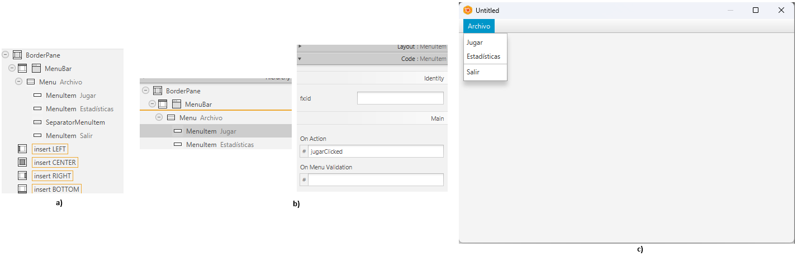
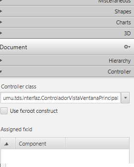
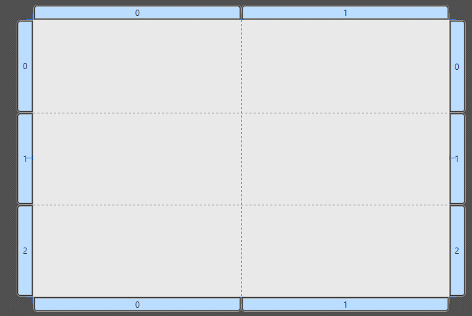
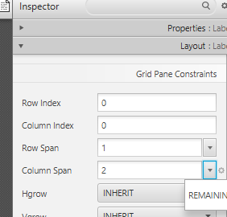
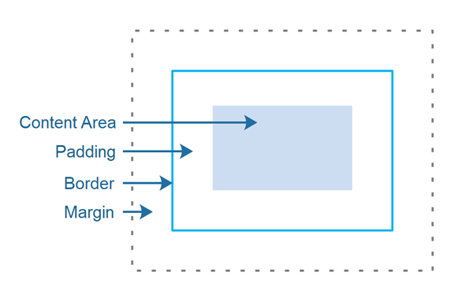
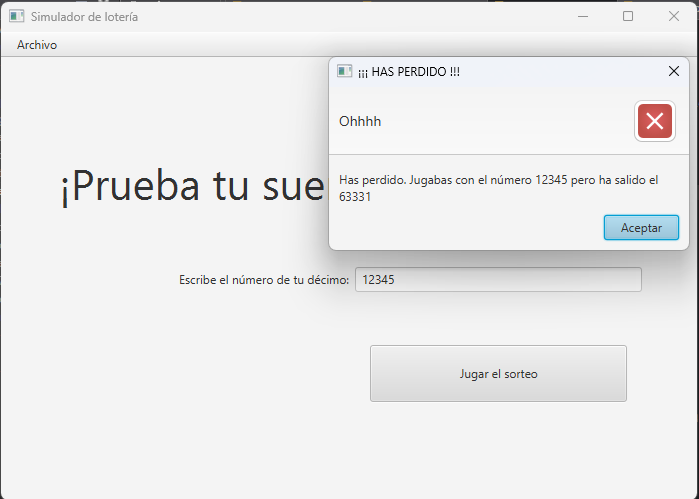
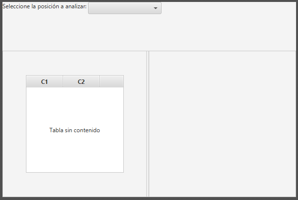
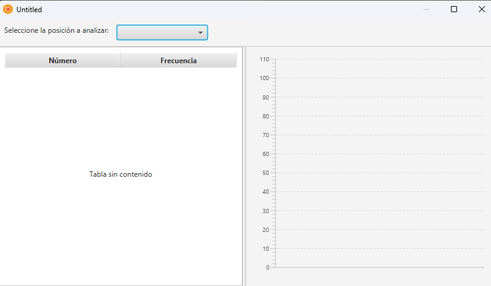
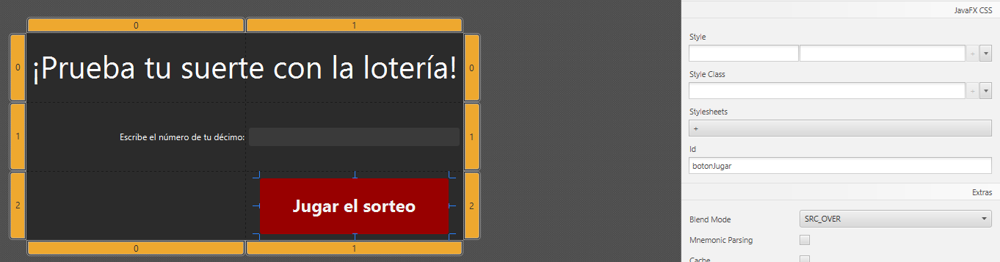

# Java FX - Boletín de ejercicios extra - Manejo de SceneBuilder

## Background

Vais a implementar la interfaz de una aplicación para jugar a la lotería contra el PC, para ir practicando de cara a la lotería de Navidad. ¡Y en solo 10 pasos (del 0 al 9)!.

Tenemos ya implementada la lógica de negocio de la aplicación. En la clase **ControladorAplicacionLoteria** tenemos 3 métodos públicos que podemos usar en nuestra interfaz:

* `public boolean participaEnSorteo(int boletoComprado)`: Método a ejecutar para simular un sorteo de lotería. Como argumento toma el número que hemos comprado, y nos devolverá _true_ si hemos ganado 'el gordo' (hemos acertado el número), _false_ en otro caso.

* `public int getUltimoNumeroPremiado()`: Nos devolverá el número que salió premiado en el último sorteo (e.d. el que se generó tras llamar a `participaEnSorteo()`).

* `public int getNumVecesValorEnPosicion(PosicionDigito posicion, int digito)`: Cada vez que se genera un sorteo se guardan las veces que ha salido cada dígito (0-9) en cada posición del boleto premiado (unidades, decenas, etc.). Con este método, dada una posición y un número del 0 al 9 nos devuelve las veces que ha salido un número premiado con ese dígito en esa posición. Por ejemplo, `getNumVecesValorEnPosicion(PosicionDigito.CENTENAS,3)` nos devolverá las veces que ha salido el número 3 en las centenas.

Además, para poder interactuar con el controlador tenemos que usar el método estático **getInstancia()**, que nos devolverá una instancia del mismo.

El código de la clase es el siguiente (copiadlo y crear la clase en vuestro proyecto Eclipse):

```java
package org.umu;

import java.util.HashMap;
import java.util.Map;

/**
 * Controlador a usar para el ejemplo del boletín extra de JavaFX
 * 
 */
public class ControladorAplicacionLoteria {

	/** 
	 * Enumeración con las distintas posiciones del boleto 
	 */
	public enum PosicionDigito {
		UNIDADES(0), DECENAS(1), CENTENAS(2), UNIDADES_MILLAR(3), DECENAS_MILLAR(4);

		int idx;	    
		PosicionDigito(int idx) {
			this.idx = idx;
		}

		public int getIdx() { return idx;}	    
	};

	/**
	 * Estructura que almacenará el número de veces que ha salido cada número en cada posición 
	 */
	private Map<PosicionDigito,Map<Integer,Integer>> historico;

	/**
	 * Instancia del controlador
	 */
	private static ControladorAplicacionLoteria instancia;
	
	/**
	 * Almacena el número premiado en el último sorteo
	 */
	private int ultimoNumeroPremiado;

	/**
	 * Método para obtener la instancia del controlador
	 * @return Instancia del controlador
	 */
	public static ControladorAplicacionLoteria getInstancia() {
		if (instancia==null) {
			instancia = new ControladorAplicacionLoteria();
		}
		return instancia;
	}
	
	/**
	 * Simula un sorteo de lotería.
	 * @param boletoComprado Boleto con el que se participa en este sorteo
	 * @return True si ha habido suerte y el boleto comprado coincide con el número premiado. False en otro caso
	 */
	public boolean participarEnSorteo(int boletoComprado) {
		ultimoNumeroPremiado = generaNumeroPremiado();
		this.guardarParaEstadisticas(ultimoNumeroPremiado);
		
		return (boletoComprado == ultimoNumeroPremiado);
	}
	
	/**
	 * Devuelve el número que ha salido en el último sorteo
	 * @return
	 */
	public int getUltimoNumeroPremiado() {
		return ultimoNumeroPremiado;
	}
	
	/**
	 * Nos devuelve el número de veces que ha salido un determinado dígito (0-9) en una determinada posición
	 * @param posicion Posición por la que estamos preguntando (unidades, decenas, etc.)
	 * @param digito Dígito por el que estamos preguntando (0-9). Importante: ha de estar entre 0 y 9
	 * @return
	 */
	public int getNumVecesValorEnPosicion(PosicionDigito posicion, int digito) {
		return historico.get(posicion).get(digito);
	}
	
	/**
	 * Genera un número aleatorio de cinco cifras usando una "fórmula mágica"
	 * @return Número de 5 cifras
	 */
	private int generaNumeroPremiado() {
		java.util.Random random = new java.util.Random();
		int numeroPremiado = 0;
		for (int i = 0; i<5;i++) {
			double aux = random.nextGaussian()*0.5+i+1;
			int auxInt = (int) Math.round(aux);
			int dig = Math.max(0, Math.min(9, auxInt));
			numeroPremiado = numeroPremiado + dig*(int)Math.pow(10,i);
		}
		return numeroPremiado;
	}

	/**
	 * Constructor privado
	 */
	private ControladorAplicacionLoteria() {
		// Inicializamos la estructura para guardar los datos históticos
		historico = new HashMap<>();
		for (PosicionDigito posicion : PosicionDigito.values()) {
			Map<Integer,Integer> valores = new HashMap<>();			 
			for (int i = 0; i<10;i++) {
				valores.put(i, 0);
			}
			historico.put(posicion, valores);
		}		 
	}

	/**
	 * Guarda internamente las veces que ha aparecido cada número (0-9) en cada posición del boleto premiado
	 * @param numero
	 */
	private void guardarParaEstadisticas(int numero) {
		for (PosicionDigito pos : PosicionDigito.values()) {
			int digito =  (numero / (int) Math.pow(10, pos.getIdx())) % 10;
			Map<Integer,Integer> conteoPorNumero = historico.get(pos);
			conteoPorNumero.put(digito, conteoPorNumero.get(digito)+1);			 
		}		 
	}
}
```

## Paso 0 - Crear y guardar el controlador

La clase controladora anterior la podemos crear y guardar en un paquete que la identifique. Por ejemplo, si nuestro proyecto está en umu.tds, la estructura completa podría ser la siguiente:

```
src/
 └─ main/
     └─ java/
         └─ umu/
             └─ tds/
                 └─ controlador/
                     └─ControladorAplicacionLoteria.java
```

## Paso 1 - Crear la clase principal para lanzar la aplicación

Vamos a crear una clase para lanzar nuestra aplicación. La llamaremos **LoteriaApp.java** y, como va a servir para lanzar la apliación con la interfaz de JavaFX, la crearemos en un paquete llamado 'interfaz':

```
src/
 └─ main/
     └─ java/
         └─ umu/
             └─ tds/
                 └─ controlador/
                 |  └─ControladorAplicacionLoteria.java
                 └─ interfaz/
                     └─ LoteriaApp.java
```

El código de la clase será el típico de las clases con método 'main' visto hasta ahora. Podemos aprovechar para ejecutar un código de pruebas sobre el controlador para asegurarnos de que funciona (lo borraremos posteriormente cuando añadamos las ventanas):

```java
import umu.tds.controlador.ControladorAplicacionLoteria;

import javafx.application.Application;
import javafx.stage.Stage;

public class LoteriaApp extends Application {

  public static void main(String[] args) {
    launch(args);
  }

  public void start(Stage primaryStage) {

	/** Código de pruebas para borrar posteriormente **/
	ControladorAplicacionLoteria loteria = ControladorAplicacionLoteria.getInstancia(); 
	int numeroAJugar = 77777;
	System.out.println("Voy a jugar con el número "+numeroAJugar+"...");
	boolean heGanado = loteria.participarEnSorteo(77777);
	if (heGanado) {
		System.out.println("HE GANADO LA LOTERIA!!!");
	} else {
		System.out.println("Ohhh he perdido!. Ha salido el número "+loteria.getUltimoNumeroPremiado());
	}
	/** FIN DE CÓDIGO DE PRUEBAS **/
	
    primaryStage.setTitle("Simulador de lotería");
    primaryStage.show();
  }
}
```

Al ejecutarse, se debe abrir una ventana vacía y en la consola debe aparecer un texto indicando que habéis perdido (a no ser que tengáis mucha suerte):

```
Voy a jugar con el número 77777...
Ohhh he perdido!. Ha salido el número 43222
```

## Paso 2 - Crear la ventana principal

En SceneBuilder, vamos a crear la ventana principal de nuestra aplicación. Haremos que esté basada en un BorderPane, con un menú en la parte posterior (posición TOP del BorderPane). Tendremos un menú _Archivo_ con tres opciones: _Jugar_ para mostrar el panel de juego, _Estadísticas_ para mostrar el panel con las veces que ha salido cada número y _Salir_ para salir de la aplicación. 

Así que seguiremos los siguientes pasos:
- Ponemos un **BorderPane** (en el desplegable "Container") como raíz de nuestra escena.
- Agregamos un **MenuBar** (en el desplegable "Controls") a la parte TOP del BorderPane
- Por defecto nos ha creado 3 menús: File, Edit y Help. Vamos a dejar la barra como la queremos. Para ello:
  + Desde la pestaña donde se muestra el grafo de la escena, desplegamos la MenuBar y borramos los menús _Edit_ y _Help_. Para ello, abrimos el menú contextual pulsando el botón derecho del ratón sobre ellos y elegimos la opción 'delete'.
  + Modificamos el menú _File_ para que se llame _Archivo_ (propiedad text).
  + Desplegamos el _Menu_ en el árbol con el grafo de la escena para mostrar sus MenuItems. El MenuItem _Close_ pasamos a que ponga _Salir_ (también propiedad text).
  + Le añadimos dos **MenuItem** más, arrastrándolos desde el desplegable en acordeón _Menu_ hasta el menú archivo. Les pondremos los nombres _Jugar_ y _Estadísticas_.
  + Para mejorar el estilo del menú, podemos añadir un **SeparatorMenuItem** antes de _Salir_.
  + Queremos que los MenuItem añadidos tengan funcionalidad. Para ello, los seleccionamos en el árbol con el grafo de la escena y pondremos en el campo _On Action_ los siguientes valores:
    - Para el MenuItem _Jugar_: jugarClicked
    - Para el MenuItem _Estadísticas_: estadisticasClicked
    - Para el MenuItem _Salir_: salirClicked
   + Otra cosa que queremos hacer es cambiar lo que haya en el panel central del **BorderPane** en función de la opción elegida. Para poder hacerlo necesitaremos acceder a él desde código, y por ello recordad que tenemos que asignarle un valor al campo _fx:id_ en el apartado _code_. Podemos llamarlo **panelGeneralP**

Recordad que en todo momento podemos simular cómo quedaría nuestra ventana con la opción _Preview --> Show Preview in Window_ o pulsando Ctrl+P. A continuación se muestra una imagen con el aspecto del grafo de la escena, la ventana y cómo se asignaría el valor al campo _On Action_ para el MenuItem _Jugar_.

|  | 
|:--:| 
| Resultado al final del paso 1. El grafo de la escena quedará como se muestra en (a), para asignar los valores a los eventos On Action de los MenuItem se haría como se indica en (b), y el aspecto final de la ventana quedaría como se muestra en (c). |

Para guardar nuestro fxml, recordad que se recomendaba hacerlo dentro de la carpeta 'resources' de nuestro proyecto, en una localización similar a donde vayamos a colocar las clases que accederán a la misma. Como esto lo vamos a llamar desde nuestro paquete _interfaz_ lo colocaremos en una carpeta con ese nombre dentro de resources. Podemos llamar a este fichero como **ventanaPrincipalLoteria.fxml**, quedando como sigue:

```
src/
 └─ main/
     ├─ java/
     |   └─ umu/
     |       └─ tds/
     |           └─ controlador/
     |           |  └─ControladorAplicacionLoteria.java
     |           └─ interfaz/
     |               └─ LoteriaApp.java
     └─ resources/
          └─ umu/
              └─ tds/
                  └─ interfaz/
                      └─ ventanaPrincipalLoteria.fxml
```

## Paso 3 - Crear el controlador de la vista de la venana principal

Como seguramente recordaréis, los archivos FXML requerían de una clase controladora. Como ya hemos definido los métodos 'on action' a los que queremos responder en ella, SceneBuilder nos puede ayudar a crearla. 

En lugar de editar directamente el FXML como hicimos en otro ejemplo, podemos indicar el nombre de la clase controladora en la pestaña _Controller_ que hay en la parte inferior izquierda de la interfaz. Llamaremos a nuestra clase controladora como **umu.tds.interfaz.ControladorVistaVentanaPrincipal** (recordad que hay que poner el nombre canónico de la clase, es decir, con los paquetes a los que pertenece delante):

|  | 
|:--:| 
| Campo donde se indica la clase que hará de controlador de presentación y responderá a los eventos de la ventana. |

Además, podemos ver un esqueleto del posible controlador con la opción del menú _View --> Show Sample Controller Skeleton_. Marcando los checkboxes _Comments_ y _Full_ podemos enriquecerlo más para que podamos copiarlo y pegarlo en Eclipse.

|  | 
|:--:| 
| Código que genera SceneBuilder como esqueleto del controlador de presentación para nuestro panel. |

Podemos crear nuestra clase **ControladorVistaVentanaPrincipal** en el paquete **interfaz** de nuestro proyecto y copiar el contenido. Podemos borrar los atributos _resources_ y _location_ ya que no los necesitaremos (así como los imports sobrantes).


```
src/
 └─ main/
     ├─ java/
     |   └─ umu/
     |       └─ tds/
     |           └─ controlador/
     |           |  └─ ControladorAplicacionLoteria.java
     |           └─ interfaz/
     |              ├─ ControladorVistaVentanaPrincipal.java
     |              └─ LoteriaApp.java
     └─ resources/
          └─ umu/
              └─ tds/
                  └─ interfaz/
                      └─ ventanaPrincipalLoteria.fxml
```

Ya que vamos a cambiar el panel central dinámicamente, prepararemos la clase para hacerlo posteriormente. Crearemos dos atributos de tipo **Parent**, que es la clase de JavaFX de mayor nivel para identificar a un nodo contenedor. En el método _initialize_ crearemos dos paneles temporales para usarlos hasta que tengamos los finales:

```java
import javafx.application.Platform;
import javafx.event.ActionEvent;
import javafx.fxml.FXML;

public class ControladorVistaVentanaPrincipal {
   	Parent panelJuego;
	Parent panelEstadisticas;
	
    @FXML // fx:id="panelGeneralP"
    private BorderPane panelGeneralP; // Value injected by FXMLLoader

    ....

    @FXML // This method is called by the FXMLLoader when initialization is complete
    void initialize() {
        
       	panelJuego = new StackPane();
        ((StackPane)panelJuego).getChildren().add(new Label("Panel de juego en construcción"));
        
        panelEstadisticas = new StackPane();
        ((StackPane)panelEstadisticas).getChildren().add(new Label("Panel de estadísticas en construcción"));
    }

}
```

La lógica de los métodos llamados al pulsar los MenuItem será asignar el panel correspondiente al panel central del BorderPane. En el caso del método _salirClicked()_, simplemente tiene que cerrar la aplicación. Además de con el método _close()_ de la stage, también podemos cerrar toda la aplicación llamando ejecutando `Platform.exit()`. Esos métodos quedarían como :

```java
import javafx.application.Platform;
import javafx.event.ActionEvent;
import javafx.fxml.FXML;

public class ControladorVistaVentanaPrincipal {

    ....

    @FXML
    void estadisticasClicked(ActionEvent event) {
    	panelGeneralP.setCenter(panelEstadisticas);
    }

    @FXML
    void jugarClicked(ActionEvent event) {
    	panelGeneralP.setCenter(panelJuego);
    }

    @FXML
    void salirClicked(ActionEvent event) {
    	Platform.exit();
    }
}
```

Lo siguiente sería modificar nuestra clase **LoteriaApp** para que cargue el FXML y lo asigne como nodo raíz de la escena.

```java

public class LoteriaApp extends Application {

    ...

  public void start(Stage primaryStage) throws IOException {

	/** Código de pruebas para borrar posteriormente **/
    ...
	/** FIN DE CÓDIGO DE PRUEBAS **/
	
	FXMLLoader loader = new FXMLLoader(getClass().getResource("ventanaPrincipalLoteria.fxml"));
    Scene scene = new Scene(loader.load(), 450, 350);
	
    primaryStage.setTitle("Simulador de lotería");
    primaryStage.setScene(scene);
    primaryStage.show();
  }
```

Si todo está correcto, al ejecutar la aplicación saldrá nuestra ventana principal con nuestro menú y funcionarán los MenuItems.

## Paso 4 - Crear el panel para jugar un número

Vamos a diseñar un panel más complejo que sirva para elegir un número y participar en un sorteo. Necesitaremos lo siguiente:
- Un campo de texto para introducir el número a jugar.
- Un botón para llamar al controlador y simular un sorteo.
- Se lanzará un cuadro de diálogo (con la clase **Alert**) para informar del resultado.

Crearemos un nuevo FXML con SceneBuilder para diseñar nuestro panel. Cumpliendo los requisitos anteriores, puedes crear el panel que quieras. Sin embargo, aquí vamos a hacer un ejemplo basado en **GridPane** para ver algunas particularidades del mismo al usarlo en SceneBuilder. Al ponerlo como raíz en un proyecto nuevo, se mostrará algo como lo siguiente:

|  | 
|:--:| 
| Aspecto de un GridPane al usarlo en SceneBuilder. |

Las pestañas azules alrededor del componente muestran la columna y la fila de cada celda del panel. Pulsando con el botón derecho del ratón sobre esas pestañas podremos añadir columnas, quitarlas, etc. En principio vamos a usar la rejilla tal y como viene, con dos columnas y tres filas. Añadiremos los siguientes elementos. 

1. En la celda superior izquierda pondremos una **Label** para poner algo como: _¡Prueba tu suerte con la lotería!_.
2. En la fila central pondremos una **Label** indicando que ha de introducir un número (primera columna) y un **TextField** para poder introducirlo (segunda columna).
3. En la celda inferior derecha pondremos un **Button** para lanzar el sorteo.

Se puede hacer que un componente ocupe más de una fila o columna del grid (propiedades row/column span). Por ejemplo, para hacer que la etiqueta de la primera celda pueda ocupar toda la primera fila, la seleccionaremos, abriremos la pestaña _Layout_ del inspector y en la propiedad _Column span_ pondremos 2 (o REMAINING, como aparece en el desplegable, que indica que se usarán el resto de columnas para el componente).

|  | 
|:--:| 
| Propiedades row/column span que aparecerán en el apartado _Layout_ de cualquier nodo dentro de una celda del **GridPane**. |

Necesitaremos asignar los siguientes elementos para poder usarlos desde el controlador:

1. En el **TextField** tendremos que asignar un valor a la propiedad _fx:id_ (apartado _Code_) para que podamos acceder a él desde el controlador y obtener el valor introducido por el usuario. Por ejemplo, podemos llamarlo **numeroTF**.
2. En la propiedad _On Action_ del botón, pondremos un método al que se llamará para iniciar el sorteo. Podemos llamarlo como **jugarClicked**.
3. En la propiedad _Controller class_ pondremos un nombre para el controlador. Recordad que ha de ser en forma canónica. Por ejemplo **umu.tds.interfaz.ControladorVistaPanelJuego**.

Lo restante a hacer en este paso sería cambiar tamaños a las etiquetas, al botón, etc., para intentar dejar el panel lo más estético posible. Algunos tips serían jugar con varias propiedades de _Layout_:
- Propiedades _Valignment_ y _Halignment_ para colocar el componente en distintas posiciones dentro de una celda.
- Propiedades _Margin_ y/o _Padding_ del componente para crear un margen alrededor (ver imagen más abajo).
- Propiedades _Max Width_ y _Max Height_. Si se cambian a MAX_VALUE, el componente se agrandará hasta ocupar todo el espacio que le deje el contenedor (su celda).

|  | 
|:--:| 
| Descripción básica de los conceptos de padding y margin. Imagen extraída de https://jenkov.com/tutorials/javafx/region.html. |

Cuando terminemos de retocarlo lo podemos guardar como **panelJuego.fxml** dentro de nuestros recursos.

```
src/
 └─ main/
     ├─ java/
     |   └─ umu/
     |       └─ tds/
     |           └─ controlador/
     |           |  └─ ControladorAplicacionLoteria.java
     |           └─ interfaz/
     |              ├─ ControladorVistaVentanaPrincipal.java
     |              └─ LoteriaApp.java
     └─ resources/
          └─ umu/
              └─ tds/
                  └─ interfaz/
                      ├─ panelJuego.fxml
                      └─ ventanaPrincipalLoteria.fxml
```

## Paso 5 - Crear un controlador para el panel de juego

De nuevo, podemos utilizar el "sample skeleton" generado para crear nuestro controlador **ControladorVistaPanelJuego**. Lo guardaremos en nuestro paquete java de la interfaz.

```
src/
 └─ main/
     ├─ java/
     |   └─ umu/
     |       └─ tds/
     |           └─ controlador/
     |           |  └─ ControladorAplicacionLoteria.java
     |           └─ interfaz/
     |              ├─ ControladorVistaPanelJuego.java
     |              ├─ ControladorVistaVentanaPrincipal.java
     |              └─ LoteriaApp.java
     └─ resources/
          └─ umu/
              └─ tds/
                  └─ interfaz/
                      ├─ panelJuego.fxml
                      └─ ventanaPrincipalLoteria.fxml
```

En este caso, vamos a realizar varias cosas. En primer lugar, el botón de jugar realizará las siguientes acciones:
  + Llamará al controlador con el número indicado en el campo de texto para iniciar el juego. 
  + Tanto si somos ganadores como perdedores, mostrará un diálogo informándonos

El código del método quedaría así:

```java
public class ControladorVistaPanelJuego {
...

    @FXML
    void jugarClicked(ActionEvent event) {
    	ControladorAplicacionLoteria loteria = ControladorAplicacionLoteria.getInstancia();
    	int boleto = 0;
    	if (!numeroTF.getText().isEmpty()) {
    		boleto = Integer.valueOf(numeroTF.getText());
    	}
    	boolean hemosGanado = loteria.participarEnSorteo(boleto);
    	if (hemosGanado) {
            Alert alert = new Alert(Alert.AlertType.INFORMATION);
            alert.setTitle("¡¡¡ PREMIO !!!");
            alert.setHeaderText("¡ENHORABUENA!");
            alert.setContentText("Has ganado la lotería con el número "+boleto);
            alert.showAndWait(); 
    	} else {
            Alert alert = new Alert(Alert.AlertType.ERROR);
            alert.setTitle("¡¡¡ HAS PERDIDO !!!");
            alert.setHeaderText("Ohhhh");
            alert.setContentText("Has perdido. Jugabas con el número "+boleto+" pero ha salido el "+loteria.getUltimoNumeroPremiado());
            alert.showAndWait();     		
    	}
    }
...
}
```

Sin embargo, en ningún momento comprobamos que lo que se introduce en el **TextField** sea un número de 5 cifras máximo, que es lo que se necesita. Para hacer eso añadiremos un objeto de tipo **TextFormatter** al campo de texto. Este objeto se encarga de comprobar si el valor que se está intentando escribir es un número permitido o no, y en caso negativo impide que el campo de texto cambie su valor. Podemos incluirlo en el método _initialize_ del controlador de la vista, que es el primero que se ejecuta al crearse ésta. (Por defecto, el skeleton del SceneBuilder ya lleva una comprobación de que hemos puesto la propiedad fx:id a los nodos necesarios).

```java
    @FXML // This method is called by the FXMLLoader when initialization is complete
    void initialize() {
        assert numeroTF != null : "fx:id=\"numeroTF\" was not injected: check your FXML file 'panelJuego.fxml'.";

        // Forzamos a que sólo se puedan introducir números en el campo de texto
        numeroTF.setTextFormatter(new TextFormatter<>(cambio -> {
            String nuevo = cambio.getControlNewText();
            return nuevo.matches("\\d{0,5}") ? cambio : null;
        }));        
    }
```

Lo siguiente sería mostrar el panel en nuestra aplicación. Para ello podemos modificar el método _intialize_ del controlador de la ventana principal (clase **ControladorVistaVentanaPrincipal**) para que, en lugar de usar el panel vacío que teníamos, cargue el que acabamos de hacer:

```java
public class ControladorVistaVentanaPrincipal {
    ...

    @FXML // This method is called by the FXMLLoader when initialization is complete
    void initialize() throws IOException {
        
    	FXMLLoader loader = new FXMLLoader(getClass().getResource("panelJuego.fxml"));
        panelJuego = loader.load();
        
        panelEstadisticas = new StackPane();
        ((StackPane)panelEstadisticas).getChildren().add(new Label("Panel de estadísticas en construcción"));
    }
}
```

Si ahora ejecutamos la aplicación podremos probar suerte con nuestros números:

|  | 
|:--:| 
| Ejemplo de funcionamiento de la aplicación tras el paso 5. |

## Paso 6 - Crear nuestro panel de estadísticas

Vamos a crear un nuevo panel para mostrar las veces que ha salido cada número en cada posición. Para ello necesitaremos:
- Un ComboBox, en el que elegiremos la posición (unidades, decenas, etc. ) que queremos analizar.
- Una tabla con dos columnas: El número y las veces que ha salido.
- Una gráfica de barras donde, en el eje X pondremos los dígitos (0 a 9) y en el eje Y las veces que han salido.

Cumpliendo esas condiciones, podéis organizar el panel a vuestro gusto. Una opción es usar de nuevo un **BorderPane** como raíz, poner en el top un **HBox** con una etiqueta y el **ComboBox**, y en el centro un **SplitPane** donde en el lado izquierdo mostrará la tabla y en el derecho la gráfica.

A la hora de añadir la tabla, recordad que tenía varios componentes, entre ellos el **TableView**, que englobaba toda la tabla, y los **TableColumn**, que había que crear uno por columna. Al insertar un control **TableView** directamente en SceneBuilder ya nos crea automáticamente dos columnas, por lo que no tenemos que añadir adicionales. Sí que podemos modificar su encabezado (seleccionando cada columna por separado, bien en el árbol o bien en el componente), y llamarlos por ejemplo "Número" y "Frecuencia" modificando su propiedad _text_.

|  | 
|:--:| 
| Tabla recién insertada en SceneBuilder dentro de un SplitPane. |

De la misma manera, podemos insertar una **BarChart** directamente sobre nuestro diseño. Se encuentra en el apartado _Charts_. Es posible que la gráfica sea muy grande y se salga del componente, en cuyo caso podremos redimensionarla a mano. 

A pesar de no indicarlo claramente, la gráfica se crea con dos ejes: uno categórico y otro numérico (en el SceneBuilder aparecen ambos categóricos, pero es incorrecto). Podemos ver el detalle si revisamos el FXML generado:

```java
<BarChart fx:id="grafica" layoutX="14.0" layoutY="23.0" prefHeight="298.0" prefWidth="299.0" AnchorPane.bottomAnchor="0.0" AnchorPane.leftAnchor="0.0" AnchorPane.rightAnchor="0.0" AnchorPane.topAnchor="0.0">
    <xAxis>
        <CategoryAxis side="BOTTOM" />
    </xAxis>
    <yAxis>
        <NumberAxis side="LEFT" />
    </yAxis>
    <padding>
        <Insets bottom="10.0" left="10.0" right="10.0" top="10.0" />
    </padding>
</BarChart>
```


De nuevo, podemos utilizar varias opciones para organizar los componentes.  Si en el grafo de la escena o en el componente pulsamos con el botón derecho del ratón, tendremos algunas opciones interesantes que, junto con padding/margin pueden mejorar el aspecto final:
- Fit to parent: Agranda el componente hasta llena todo el espacio permitido por el padre. Interesante para la gráfica y la tabla.
- Use computed sizes: Hace el contenedor lo más pequeño posible en funcion de lo que contiene. Interesante para usar en el HBox del encabezado.

En las propiedades de la tabla también podemos cambiar el _Column Resize Policy_ a "constrained-resize" para que cambien de tamaño automáticamente.

Una posible vista final quedaría como sigue:

|  | 
|:--:| 
| Posible vista final del panel de estadísticas. |


Lo siguiente sería añadir las propiedades del apartado _code_ que necesitamos. Son las siguientes:

- El fx:id para el combobox donde vamos a añadir las posiciones de cada numéro. Lo podemos llamar **comboPosicionCB**;
- También tendremos que asignarle un "On Action" para que cuando cambie actualicemos los modelos de la tabla y la gráfica. Podemos llamarlo **comboPosicionChanged**
- Necesitaremos también asignar fx:id al **TableView** para asignarle el modelo, y a cada uno de los **TableColumn** para poder manejarlos. Podemos llamarles **datosTV**, **nombreCol** y **frecuenciaCol** respectivamente.
- También habrá que tener un fx:id para la gráfica y así cambiar sus dato. Podemos llamarlo **grafica**.

Por último indicaremos en el apartado _Controller_ que la clase controladora será **umu.tds.interfaz.ControladorVistaPanelEstadisticas**

Guardaremos el resultado en el mismo lugar que el resto de fxml, con el nombre de **panelEstadisticas.fxml**


```
src/
 └─ main/
     ├─ java/
     |   └─ umu/
     |       └─ tds/
     |           └─ controlador/
     |           |  └─ ControladorAplicacionLoteria.java
     |           └─ interfaz/
     |              ├─ ControladorVistaPanelJuego.java
     |              ├─ ControladorVistaVentanaPrincipal.java
     |              └─ LoteriaApp.java
     └─ resources/
          └─ umu/
              └─ tds/
                  └─ interfaz/
                      ├─ panelEstadisticas.fxml
                      ├─ panelJuego.fxml
                      └─ ventanaPrincipalLoteria.fxml
```

## Paso 7 - Crear un controlador para nuestra vista de estadísticas

De nuevo, creamos una clase llamada **ControladorVistaPanelEstadisticas** en nuestro proyecto Eclipse y copiamos en ella el esqueleto que genera el SceneBuilder. 

Lo primero será rellenar los datos del ComboBox con las posiciones de los dígitos. Podemos emplear directamente el enumerado que hay creado en el controlador principal de la aplicación. También es necesario poner los tipos correspondientes en la declaración del componente:

### Modelo del combo box 

```java
public class ControladorVistaPanelEstadisticas {

    ...

    @FXML // fx:id="comboPosicionCB"
    private ComboBox<ControladorAplicacionLoteria.PosicionDigito> comboPosicionCB; // Value injected by FXMLLoader -- PONEMOS EL TIPO DE ELMENTOS QUE CONTIENE

    ...

    @FXML // This method is called by the FXMLLoader when initialization is complete
    void initialize() {
        assert comboPosicionCB != null : "fx:id=\"comboPosicionCB\" was not injected: check your FXML file 'panelEstadisticas.fxml'.";
        assert datosTV != null : "fx:id=\"datosTV\" was not injected: check your FXML file 'panelEstadisticas.fxml'.";
        assert frecuenciaCol != null : "fx:id=\"frecuenciaCol\" was not injected: check your FXML file 'panelEstadisticas.fxml'.";
        assert grafica != null : "fx:id=\"grafica\" was not injected: check your FXML file 'panelEstadisticas.fxml'.";
        assert nombreCol != null : "fx:id=\"nombreCol\" was not injected: check your FXML file 'panelEstadisticas.fxml'.";

        // Asignamos los items al combo box
        comboPosicionCB.getItems().addAll(ControladorAplicacionLoteria.PosicionDigito.values());
        
    }

}
```

### Configuración de la tabla

Hay que indicar qué tipo de datos mostrará la tabla. Como vamos a mostrar pares de número - frecuencia (p. ej. "el número 0 ha salido 7 veces"), podemos utilizar la clase de conveniencia de JavaFX llamada **Pair**, que sirve para modelar un par de elementos cualquiera. Así pues, la tabla mostrará objetos de tipo **Pair\<Integer,Integer\>** y así habrá que indicarlo en la declaración del controlador. Del mismo modo, las columnas serán de tipo <Pair,Integer>:

```java
public class ControladorVistaPanelEstadisticas {

    ...

     @FXML // fx:id="datosTV"
    private TableView<Pair<Integer,Integer>> datosTV; // Value injected by FXMLLoader

    @FXML // fx:id="frecuenciaCol"
    private TableColumn<Pair<Integer,Integer>, Integer> frecuenciaCol; // Value injected by FXMLLoader
    
    @FXML // fx:id="nombreCol"
    private TableColumn<Pair<Integer,Integer>, Integer> nombreCol; // Value injected by FXMLLoader
    ...
}
```

También habrá que configurar los _CellValueFactory_ para cada columna, es decir, los objetos que dado un Pair devolverán qué mostrar en cada caso. Esto también se hará en el método _initialize_. Lo único es recordar que el número lo pondremos en el atributo "key" del par y la frecuencia en el "value":

```java
    @FXML // This method is called by the FXMLLoader when initialization is complete
    void initialize() {
        ...

        // Datos para el Combo box
        comboPosicionCB.getItems().addAll(ControladorAplicacionLoteria.PosicionDigito.values());
        
        // Configuración de las columnas de la tabla
        numeroCol.setCellValueFactory(new PropertyValueFactory<>("key"));
        frecuenciaCol.setCellValueFactory(new PropertyValueFactory<>("value"));
    }
```

### Configuración de la gráfica

De igual manera, habría que indicar en la gráfica los tipos de datos de la misma en la declaración. En el eje X vamos a tener los números del 0 al 9, pero los trataremos de manera discreta y por tanto como categorías (los convertiremos a String), y en eje Y sí que tendremos valores numéricos:

```java
public class ControladorVistaPanelEstadisticas {

    ...

    @FXML // fx:id="grafica"
    private BarChart<String, Number> grafica; // Value injected by FXMLLoader

    ...

```

### Actualización de los modelos

Quedaría actualizar los modelos de la tabla y la gráfica. Esto lo cada vez que cambie el **ComboBox**, es decir, en el método _comboPosicionChanged_ que hemos creado. Para ello, en primer lugar pedimos al controlador principal de la aplicación que nos devuelva las veces que ha aparecido cada número en la posición seleccionada en el combo, y cremos una lista para ello

```java
@FXML
    void comboPosicionChanged(ActionEvent event) {
    	ControladorAplicacionLoteria loteria = ControladorAplicacionLoteria.getInstancia();
    	
    	// Recogemos la posición del dígito que queremos analizar
    	PosicionDigito posicion = comboPosicionCB.getSelectionModel().getSelectedItem();
    	
    	if (posicion!=null) {
    		// Lista que será la base para el modelo de datos de la tabla
    		List<Pair<Integer,Integer>> listaFrecuencias = new ArrayList<>();
    		// Objeto Series que será parte del modelo de datos de la gráfica
        	XYChart.Series<String, Number> serieFrecuencias = new XYChart.Series<>();

        	// Rellenamos las estructuras de datos preguntando al controlador
        	for (int digito = 0; digito<10;digito++) {        		
        		int frecuencia = loteria.getNumVecesValorEnPosicion(posicion, digito);
        		
        		listaFrecuencias.add(new Pair<Integer,Integer>(digito,frecuencia));
        		serieFrecuencias.getData().add(new Data<String,Number>(String.valueOf(digito),frecuencia));
        	}
        	
        	// Actualizamos el modelo de la tabla
        	datosTV.setItems(FXCollections.observableArrayList(listaFrecuencias));

        	// Actualizamos el modelo de la gráfica
        	grafica.setData(FXCollections.observableArrayList(Arrays.asList(serieFrecuencias)));
    		
    	} else {
        	datosTV.setItems(FXCollections.observableArrayList(new ArrayList<>()));
        	grafica.setData(FXCollections.observableArrayList(new ArrayList<>()));    		
    	}    	
    }
```

### Añadir el panel a la ventana principal

Por último habría que mostrar el panel en nuestra aplicación. Para ello voveremos a  modificar el método _intialize_ del controlador de la ventana principal para que, en lugar de usar el panel vacío que teníamos, cargue el que acabamos de hacer:

```java
public class ControladorVistaVentanaPrincipal {
    ...

    @FXML // This method is called by the FXMLLoader when initialization is complete
    void initialize() throws IOException {
        
    	FXMLLoader loader = new FXMLLoader(getClass().getResource("panelJuego.fxml"));
        panelJuego = loader.load();
        
    	FXMLLoader loaderEst = new FXMLLoader(getClass().getResource("panelEstadisticas.fxml"));
        panelEstadisticas = loaderEst.load();
    }
}
```

## Paso 8 - Darle un toque de estilo

El programa ya es funcional, pero puede que queramos cambiar su estilo. Para ello podemos utilizar una hoja de estilos CSS. Tenéis toda la información sobre los posibles estilos de cada nodo en https://docs.oracle.com/javafx/2/api/javafx/scene/doc-files/cssref.html.

Crearemos un nuevo fichero **estilos.css** y lo colocaremos en la misma subcarpeta de recursos donde hemos colocado los FXML.

```
src/
 └─ main/
     ├─ java/
     |   └─ umu/
     |       └─ tds/
     |           └─ controlador/
     |           |  └─ ControladorAplicacionLoteria.java
     |           └─ interfaz/
     |              ├─ ControladorVistaPanelJuego.java
     |              ├─ ControladorVistaVentanaPrincipal.java
     |              └─ LoteriaApp.java
     └─ resources/
          └─ umu/
              └─ tds/
                  └─ interfaz/
                      ├─ panelEstadisticas.fxml
                      ├─ panelJuego.fxml
                      ├─ estilos.css
                      └─ ventanaPrincipalLoteria.fxml
```

Podemos reutilizar el modo oscuro de otras prácticas:

```css
.root {
    -fx-base: #2b2b2b;
    -fx-background-color: #2b2b2b;
    -fx-text-fill: white;
}

.button {
    -fx-background-color: #444;
    -fx-text-fill: #eee;
}

.text-field {
    -fx-background-color: #3a3a3a;
    -fx-text-fill: #fff;
    -fx-prompt-text-fill: #999;
}
```

Aunque también podemos añadir un caso "especial" para el botón que inicia el juego. Queremos que tenga fondo rojo. Como es para un elemento concreto, lo marcaremos con un '#':

```css
#botonJugar {
    -fx-background-color: #a00000;
    -fx-font-weight: bolder;
    -fx-font-size: 24;
    -fx-text-fill: #ffffff;
}
```

Para indicar que el botón de jugar tenga ese estilo tenemos que ponerle el identificador 'botonJugar' en su propiedad Id (OJO, es distinta de la fx:id que usábamos para el código). Lo modemos hacer desde el SceneBuilder. De hecho, podemos cargar la hoja de estilos y probarla añadiéndola con la opción _Preview --> Scene Style Sheets --> add Style Sheet_ y elegir el fichero que acabamos de crear.

|  | 
|:--:| 
| Estilo aplicado desde SceneBuilder. Botón de jugar con estilo propio. |

Para aplicar el estilo a la aplicación tan solo hay que cargarlo antes de asignar la escena en la clase **LoteriaApp**:

```java
public class LoteriaApp extends Application {

....

  public void start(Stage primaryStage) throws IOException {
   
  ....

    Scene scene = new Scene(ventanaPrincipal, 450, 350);
    primaryStage.setTitle("Simulador de lotería");
    scene.getStylesheets().add(getClass().getResource("estilos.css").toExternalForm());
    primaryStage.setScene(scene);
    primaryStage.show();
  }
}

```

## Paso 9 - Intenta ganar la lotería

Es hora de disfrutar de tu aplicación. Juega varias veces e intenta descubrir qué combinación es la que puede ocurrir con más probabilidad. ¡Mucha suerte!.